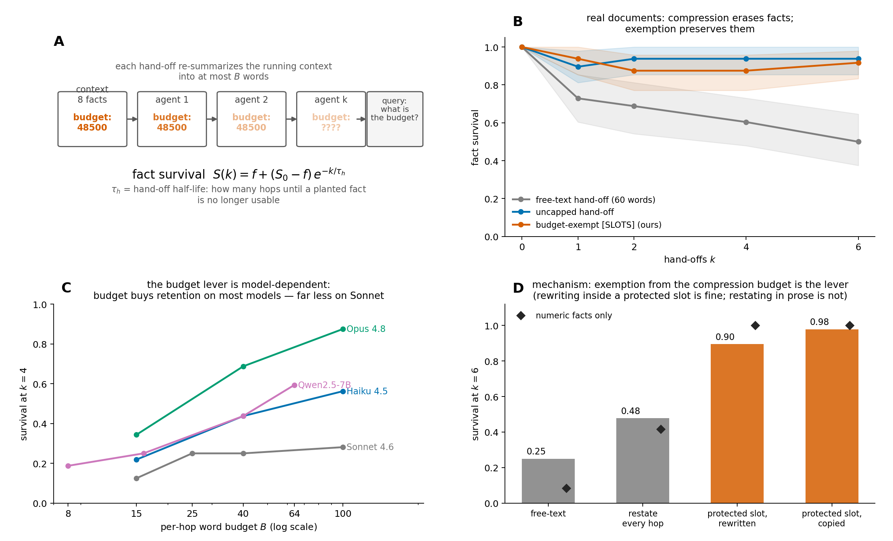

# The Half-Life of Information Across Agent Hand-offs

When LLM agents pass work to each other, each hand-off re-summarizes the running
context — and every re-summarization is a lossy channel. This repository measures what
that channel does to specific, load-bearing facts (a budget, a deadline, a
do-not-touch constraint), across models from **0.5B to frontier scale**, and
characterizes the result as a **hand-off half-life**:

$$S(k) \;=\; f + (S_0 - f)\,e^{-k/\tau_h}$$

where $S(k)$ is the probability a planted fact is still *usable* after $k$ hand-offs,
$f$ is the guessability floor, and $\tau_h$ — the half-life — is the number of hops a
fact survives. τ_h turns "agents forget things" into a measurable, comparable,
provisionable quantity.



**A.** The relay protocol: facts ride a chain of budgeted summarize-and-hand-off steps,
then a downstream agent is queried. **B.** On real documents, budget-pressured
hand-offs erase half the facts by six hops, while a budget-exempt `[SLOTS]` block
preserves them (+0.42 [0.27, 0.56]). **C.** How much retention a bigger summary budget
buys is itself model-dependent. **D.** The mechanism is *exemption from the
compression budget* — not verbatim copying, and not prose restatement.

## Key findings

1. **Fact survival across hand-offs decays exponentially** with a fittable half-life
   (AICc-selected against linear/constant/power-law), reproduced in three substrates:
   the synthetic relay, a LangGraph re-implementation, and real coherent documents.
2. **It is the compression, not the context length.** In a token-matched three-arm
   control, the hand-off arm decays to floor while long-context and verbatim
   pass-through arms stay flat.
3. **The channel dominates the model.** τ_h scales with the per-hop word budget
   (τ ∝ B^0.82, r² ≈ 1.0 on Qwen-7B) but is nearly flat in parameter count across a
   0.5B→32B same-family ladder (clean α ≈ 0.06, CI includes 0).
4. **Budget responsiveness is model-dependent at the frontier.** Haiku 4.5 and
   Opus 4.8 convert extra budget into retention (k=4 survival 0.22→0.56 and 0.34→0.88
   over a 6.7× budget increase); Sonnet 4.6 converts far less (0.12→0.28; paired
   contrast vs Haiku +0.33 [0.16, 0.50]).
5. **Fact types die differently, and the ordering is a model property.** Numbers and
   preferences are fragile; which type is *worst* varies by model (preference on
   Sonnet/Mistral/Phi, numeric on Qwen) — the folk rule "protect the numbers" picks
   wrong on most models tested. The ordering measured synthetically **replicates on
   real documents**.
6. **The working lever is budget exemption.** A protected `[SLOTS]` section that does
   not participate in the compression budget lifts numeric survival from 0.08 to 1.00
   at k=6 and holds through k=20 — even when the slot is *rewritten* every hop
   (verbatim copying is unnecessary: +0.075 [0.00, 0.18] over rewriting). In-band
   prose tricks (restating, stance, re-encoding, parallel-chain voting) all fail on
   numbers; parallel chains fail because erasures are *correlated*.
7. **Deployed compact memory is robust on this axis — measured here for the first
   time.** In three pre-registered head-to-heads, a faithful Mem0-style extract+merge
   memory held facts where free text collapsed, and its soft adaptive compression beat
   hard slot protection under extreme scarcity. The negatives are reported in full.
8. **Allocation should be measured, not guessed.** With a scarce protection budget,
   ranking facts by measured per-type survival matches the oracle allocation live on
   Sonnet and beats the folk heuristic — because of finding 5.

## Repository layout

```
├── README.md                  ← you are here
├── EXPERIMENTS.md             ← full experiment map: script → prereg → result → verdict
├── harness/                   ← core library
│   ├── facts.py               #   fact taxonomy (numeric/entity/negation/preference)
│   ├── relay.py               #   the hand-off relay: planting, compression framings, chains
│   ├── grade.py               #   answer grading (word-boundary exact match; yes/no logic)
│   ├── run.py                 #   sweep runner (rows → JSONL)
│   ├── analyze.py             #   free-floor exponential fits, AICc, bootstrap CIs
│   ├── backends.py            #   atomic-write response cache
│   ├── model_backends.py      #   HF + API backends (temp=0 everywhere it is supported)
│   ├── realdocs.py            #   real-content corpus: 6 documents × 8 embedded facts
│   └── figures.py             #   paper figures
├── experiments/               ← every experiment script (see EXPERIMENTS.md)
├── preregistrations/          ← predictions committed BEFORE each run (29 files)
├── out/pilot/                 ← result JSONs + per-fact row JSONLs (path kept verbatim
│                                 so every script runs unmodified from the repo root)
├── out/figs/                  ← generated figures
├── data/                      ← response caches (~18 MB) → most analyses replay with
│                                 ZERO API calls
├── scripts/
│   ├── make_overview_figure.py
│   └── anvil/                 ← SLURM scripts for the GPU-cluster model ladder
└── tests/                     ← 28 unit + pipeline tests
```

## Quickstart

```bash
pip install -r requirements.txt
python -m pytest -q                          # install check → 28 passed
```

**Tier 0 — no API key needed.** The shipped response caches make the statistical
analyses fully replayable:

```bash
python experiments/e_ci_backfill.py          # headline contrasts + bootstrap CIs
python experiments/uep_allocation.py         # allocation policies on cached survival rows
python scripts/make_overview_figure.py       # regenerate the figure above
```

**Tier 1 — rerun an experiment** (results are cached per prompt, so partial reruns are
cheap and interrupted runs resume for free):

```bash
export ANTHROPIC_API_KEY=...
python experiments/e14_real_anchor.py anthropic claude-sonnet-4-6
```

**Tier 2 — the open-model ladder** (Qwen 0.5B–32B, Mistral, Phi) runs on a SLURM
cluster via `scripts/anvil/`.

On plain `python` invocations, put the code on the import path first —
`pytest` picks this up automatically from `pytest.ini`:

```bash
export PYTHONPATH=harness:experiments        # Linux/macOS
$env:PYTHONPATH = "harness;experiments"      # Windows PowerShell
```

## The measurement

A **fact** is a minimal, checkable statement of one of four types — numeric
(`The budget ceiling is 25000.`), entity, negation (polarity-balanced), preference —
planted among distractor facts. The chain then performs $k$ hand-offs; at each one the
model must compress the running context into at most $B$ words ("you cannot keep
everything — keep only what matters most"). At depth $k$ a fresh agent answers the
fact's query from the final carry, graded by word-boundary exact match (negations by
first yes/no token). Survival curves are fit with the free-floor exponential above;
uncertainty is bootstrap-over-facts (seeds are not replication under temp-0 greedy
decoding). Guess floors are measured empirically per type with a no-fact arm.

## The real-content corpus

`harness/realdocs.py` ships six realistic workplace documents (incident postmortem,
sprint kickoff, vendor minutes, onboarding brief, design review, escalation hand-off).
Each embeds 8 verifiable facts *woven into coherent prose* — no templated fact lists,
no filler. Verbatim presence of every fact sentence is asserted at import. On this
corpus, budgeted hand-offs lose half the facts by k=6 and the synthetic fragility
ordering replicates; an uncapped hand-off chain barely decays, which scopes the
phenomenon precisely: **the half-life is a property of compression under contention,
not of relaying per se.**

## Pre-registration discipline

Every experiment's predictions and readout bands were committed before the run
(`preregistrations/`, one JSON per experiment, 29 total). Verdicts were taken from the
pre-registered bands — which is why this repository contains honest negative results
(three lost head-to-heads against a deployed memory baseline, a failed provisioning
test on a degenerate surface, a rescued-then-refuted transcription hypothesis) next to
the positive ones. Where two bands overlapped due to drafting ambiguity, both are
disclosed and the conservative reading is adopted.

## Model notes

- All models run at temperature 0 where the API supports it; newer models that
  deprecate the parameter run at provider-default decoding (disclosed per run).
- One frontier model (`claude-fable-5`) is excluded: it deterministically refuses
  ~34% of terse recall probes (`stop_reason: refusal`) under both available decoding
  regimes, which confounds any retention measurement. The artifact grid is archived
  in `out/pilot/` and not used.
- Open-model results (Qwen2.5 0.5B–32B, Mistral-7B, Phi-3) were produced on A100/H100
  nodes via the SLURM scripts in `scripts/anvil/`.

## License

[MIT](LICENSE)

## Citation

Paper in preparation. Until then, please cite the repository:

```bibtex
@misc{agent-handoff-halflife,
  title  = {The Half-Life of Information Across Agent Hand-offs},
  author = {Zijian Su},
  year   = {2026},
  note   = {https://github.com/USERNAME/agent-handoff-halflife}
}
```
